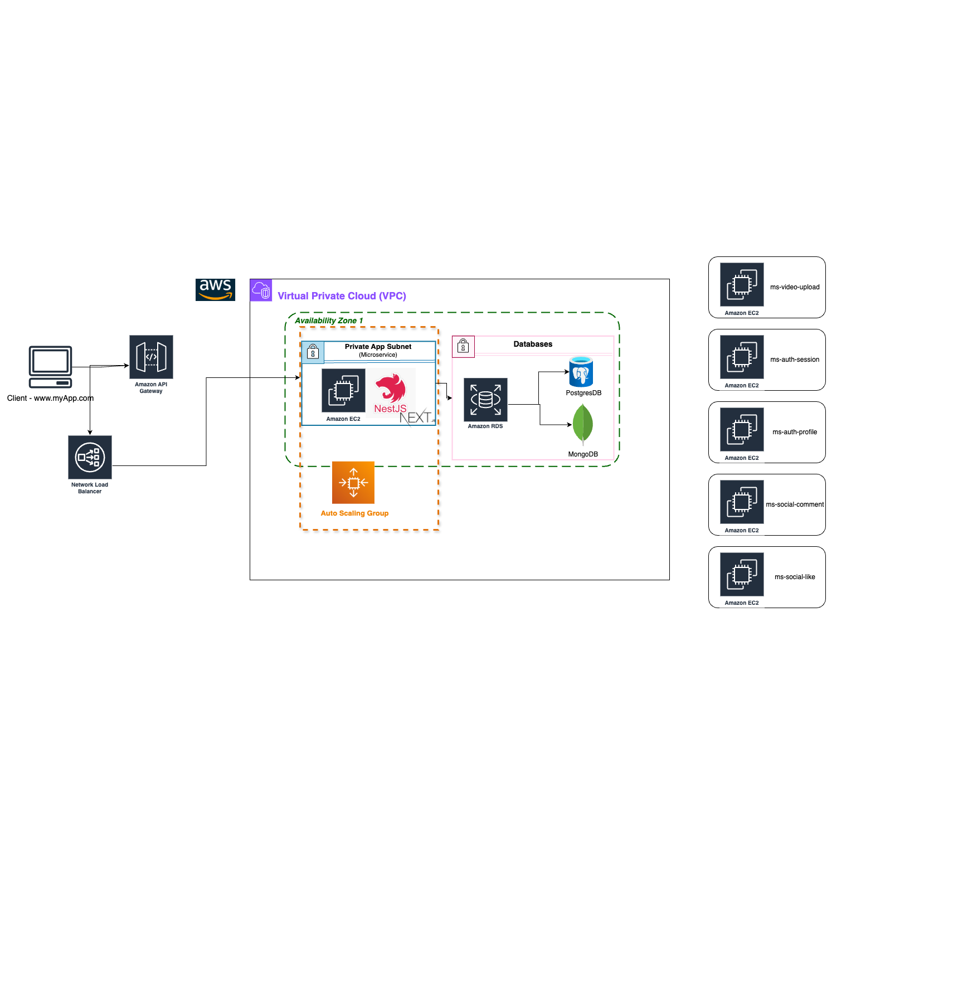

# Application Streaming Platform - Readme

## Table of Contents

1. [Overview](#overview)
2. [Microservices](#microservices)
   - [Init App](#init-app)
   - [Authentication and User Microservices](#authentication-and-user-microservices)
   - [Content (Videos) Microservices](#content-videos-microservices)
   - [Social Interaction Microservices](#social-interaction-microservices)
3. [Databases](#databases)
4. [Technologies](#technologies)
5. [Design Principles](#design-principles)
6. [Scalability and Resilience](#scalability-and-resilience)
7. [Practical Implementations](#practical-implementations)
8. [Init Configuration](#init-configuration)
   - [Install Docker in EC2](#install-docker-in-ec2--grant-privileges-of-startup)
   - [Pull Images from Docker Hub](#pull-images-from-docker-hub-in-ec2)
   - [Delete Containers and Images](#delete-containers-and-images-in-ec2)
   - [Build Projects](#build-projects)
     - [Java (Spring Boot)](#java-springboot)
     - [NestJS | Next.js](#nestjs--nextjs)

---

## Overview

This project is a scalable, microservices-based streaming platform designed with cutting-edge technologies and best practices to deliver high performance and maintainability. The architecture leverages REST APIs, GraphQL, WebSocket, WebHook, RPC, and SOAP for diverse communication needs, supported by a robust DevOps pipeline and monitoring solutions.

---

## Microservices

### Init App

- **Base URL**: [http://54.157.182.4:4000](http://54.157.182.4:4000)

---



### Authentication and User Microservices (sv-ms-auth) - (JS NestJS) → (PostgreSQL)

1. **Authentication Service (sv-ms-auth-session)** | port: 9000
   - Login, logout, and JWT token generation.
   - Session management and token renewal.
   - Password recovery via OTP or token.
2. **Profile Account Management Service (sv-ms-auth-profile)** | port: 9001
   - Profile updates.
   - Account deletion.

### Content (Videos) Microservices (sv-ms-video) - (JS NestJS) → (PostgreSQL)

3. **Video Upload Service (sv-ms-video-upload)** | port: 9004
   - Video processing and storage.
   - Metadata management (title, description, tags).
4. **Video Feed Service (sv-ms-video-feed)** | port: 9004
   - Recommendation generation based on history and preferences.
   - Video pagination and ranking.

### Social Interaction Microservices (sv-ms-social) - (Java & Spring Boot) → (MariaDB)

5. **Comment Service (sv-ms-social-comment)** | port: 9009
   - Creation, editing, and deletion of comments.
6. **Likes and Dislikes Service (sv-ms-social-like)** | port: 9010
   - Tracking of likes and dislikes.
   - Statistics for popularity metrics.

---

## Databases

1. **Users and Authentication**: Relational database (PostgreSQL).
2. **Videos and Metadata**: Relational database (PostgreSQL).
3. **Comments**: Relational database (MariaDB).
4. **Likes and Dislikes**: Relational database (MariaDB).

---

## Technologies

- **Programming Languages**: JavaScript (NestJS), Java.
- **Frontend**: React, Next.js 14, Tailwind CSS.
- **Databases**: PostgreSQL, MariaDB.
- **Authentication**: SHA-256 encryption (bcrypt to hash passwords), CORS.
- **Cloud Services**: AWS EC2 (Linux/AWS), S3.
- **Load Balancing**: AWS Load Balancer.
- **DevOps**: Git version control.

---

## Design Principles

- **KISS**: Simplify design for ease of understanding. Example:

```jsx
"use client";

import React, { useEffect, useState } from "react";

const OnlyClient: React.FC<{ children: React.ReactNode }> = ({ children }) => {
  const [mounted, setMounted] = useState(false);

  useEffect(() => {
    setMounted(true);
  }, []);

  if (!mounted) return null;

  return <>{children}</>;
};

export default OnlyClient;
```

- **DRY**: Reduce redundancy in code.
  Example: (Same component is used in any places)

```jsx
"use client";
import { useAuthStore } from "@/hooks/use-auth";
import Link from "next/link";
import React from "react";

interface HeaderProps {
  title: string;
}

const Header = ({ title }: HeaderProps) => {
  const { getToken } = useAuthStore();
  const email = getToken();
  return (
    <header className="flex items-center justify-between mb-8">
      <h1 className="text-2xl font-bold">{title}</h1>
      {!email && (
        <button className="bg-red-600 hover:bg-red-700 px-4 py-2 rounded-md text-white font-semibold">
          <Link href={"/auth/login"}>Login</Link>
        </button>
      )}
    </header>
  );
};

export default Header;
```

---

### Scalability and Resilience

- **Horizontal Scaling**: Auto Scaling Groups (ASG) for EC2 instances.

---

### Practical Implementations

- **Microservices**: +20 REST APIs with diverse communication styles.
- **Frontend**: Integrated client consuming all microservices.
- **Databases**: 3+ databases across relational
- **Operating Systems**: Linux/AWS.
- **Languages**: JavaScript, Java
- **Security**: JWT, encryption, CORS.

---

## Init Configuration

### Install docker in EC2 | Grant Privileges of startup

```bash

# Install docker

sudo dnf install docker -y

# Add group of user

sudo usermod -aG docker ec2-user
newgrp docker

# Run docker in startup

sudo systemctl start docker
sudo systemctl enable docker
```

### Pull Images from Docker HUB in in EC2

```bash

# Push changes from local machine to docker hub

docker buildx build --platform linux/amd64 -t edchulde/ms-auth-session:latest --push .

# Pull changes from EC2
# latest(means tag)
docker run -d --restart=always -p 9000:3000 --name ms-auth-session edchulde/ms-auth-session:latest
```

### Delete containers and images in EC2

```bash
# Stop containers

docker stop $(docker ps -aq)

# Remove containers

docker rm $(docker ps -aq)

# Remove images

docker rmi $(docker images -aq)
```

### Build proyects

#### Java (Springboot)

```bash

# Build proyect

./gradlew clean build

# Run proyect

./gradlew bootRun
```

#### NestJs | Nextjs

```bash

# Build proyect

npm run build

# Run proyect

npm run start:dev
```

```bash

# Build proyect

npm run build

# Run proyect

npm run dev
```

This project adheres to industry best practices and aims to provide a comprehensive streaming solution with a focus on scalability, security, and user experience.
